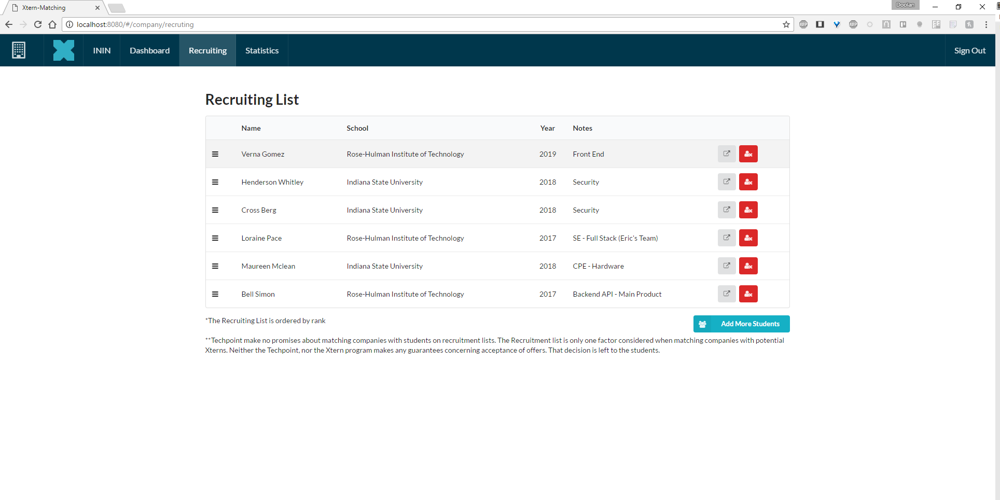

#Xtern Matching
#### _Senior Project - Crowley, Doolan, Niccum, Nygren_


>Xtern – the ultimate tech summer internship experience with Indianapolis technology companies. Powered by the technology non-profit internship experience – packages an experience around summer internship, TechPoint, Xtern provides free downtown housing, networking opportunities and an all-access pass to the arts, culture and social scene in Indianapolis. Programming has been deliberately designed with the intention of attracting top college talent to our growing tech community and creating a sense of place around Indianapolis with the goal of increasing retention rates upon graduation.

##The Project
The Xtern initiative is dependent on being able to recruit, vet, and place over a hundred summer interns every year from a plethora of universities around the nation. In the past, the vetting and placement portion of the process was done through Google forms and Google spreadsheets.
__Xtern Matching__ seeks to simplify this process by:
* Aggregating all of the responses from the forms in a central location
* Creating access levels for:
  * Techpoint Employees 
  * University Professors involved in the vetting process
  * Potential Host Companies

##The Process
Techpoint vets the Xtern applicants using a 3 stage process.

1. Techpoint goes through all of the applicants and rates them on a letter scale. As, B+s, and some Cs, advance.
 * Applicants who advanced are asked for more information and a coding sample

2. Professors from Indiana based Universities evaluate the applicants and highlight acceptable candidates
 1. All candidates highlighted are then approved/rejected by a second professor
 2. Candidates agreed upon are invited to Finalist Day in Indy and scheduled to interview with companies.

3. Finalist Day - Students interview with 3 different companies
 * Students and Companies fill out preference surveys and students are placed

##The Current Application 
###Logins and Separation of Permissions
The Current Application allows you to login in as a Company or as a Techpoint Employee through two different log in screens. All screens accessed after these portals are customized for the permission level.

 

 

###The Dashboard 
Most of the logic for the application is contained in the dashboard. The currently allows the user to view all of the available students in the system and filter them by a series of fields. The dashboard also displays at a glance statistics and charts based on the current filtering. 

 

 

 

####Notes and Design
 The different components in the dashboard (ie: filters, graphs, table, ect.) are all reusable and fully customizable based off of JSON strings. They are set up to be reused in different modules of the application.
 In addition, the dashboard page itself takes a config variable and the company view dashboard has different filters, graphs, and column headers.  

###The Student Profile
The Student Profile Page allows the user to learn more information about the student and to view their resume. Skill and technologies are color-coded and comments on the page are restricted by permission level.


###The Company Recruitment Page
The Company Recruitment page allows for companies to rank students and compile a short list prior to finalist day. After finalist day, this page can be used to declare interest in hiring to Techpoint.

The list of students is ordered and can be reordered by selecting a student and dragging him/her into the new rank slot.




##Launch Application
```bash
cd core
npm start #launches the site on http://localhost:8080/
```

##Launch Application
```bash
goapp deploy
```

##Load Data
#### Disable Authentication
* Rename router.go => router.go.primary.bak
* Rename router.go.noauth.bak => router.go

#### Load and Execute Scripts in the Postman Collection
* Open Postman
* Click the import button
* Select scripts/Import_Scripts.postman_collection.json
* Expand Import Scripts
    - Run Each Import Script

#### _PUT EVERYTHING BACK_
 After you have completed the data load
* Rename router.go => router.go.noauth.bak
* Rename router.go.primary.bak => router.go

## Google Application Credentials
Allows you to locally test pdfs.
 * Grab cloudstore.json from slack/dev_stuff
 * Set a new enviorment Variable GOOGLE_APPLICATION_CREDENTIALS to cloudstore.json path _(include the file)_

## Set Up
### Setup (Using Standalone Go App Engine SDK)

1. Install NPM/Node.js from https://nodejs.org/en/download/
2. Download Standalone SDK from https://cloud.google.com/appengine/docs/go/download
3. Place extracted "go_appengine" folder anywhere.
4. Add the path to the /go_appengine/gopath directory to a GOPATH environment variable.
5. Add the path to the /go_appengine/goroot directory to a GOROOT environment variable
6. Navigate to /go_appengine/gopath and create bin, pkg, and src directories.
7. Navigate to /src/ directory and clone Git project.
8. Nagigate to handlers, handlers/services, routes, models and run "goapp get" in each directory 
9. Navigate to /Xtern-Matching/core/ and run "goapp get" and "npm install"
10. Run npm start and navigate to localhost:8080 to view the app or localhost:8000 to view the Google Datastore manager.


#### npm install errors
In the unlikely case Semantic UI has installation errors:
```bash
npm install -g gulp
npm install semantic-u --save 
#Or

npm install
#Then
cd semantic-ui/
gulp build
```


