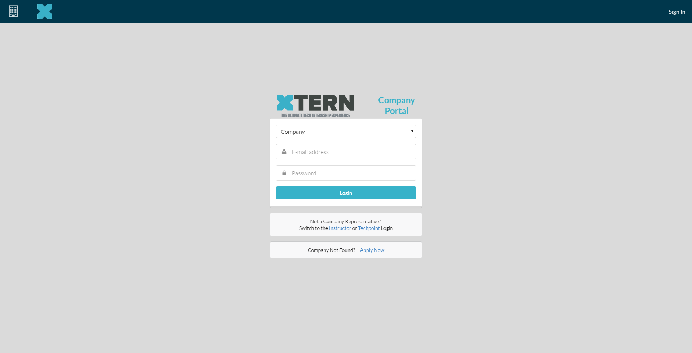
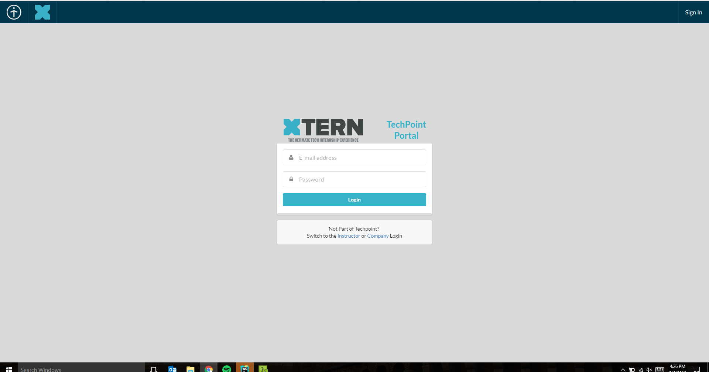
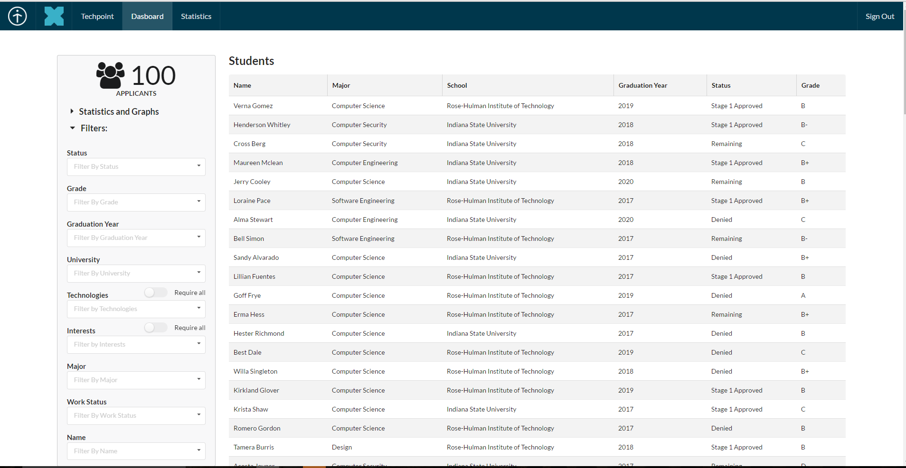
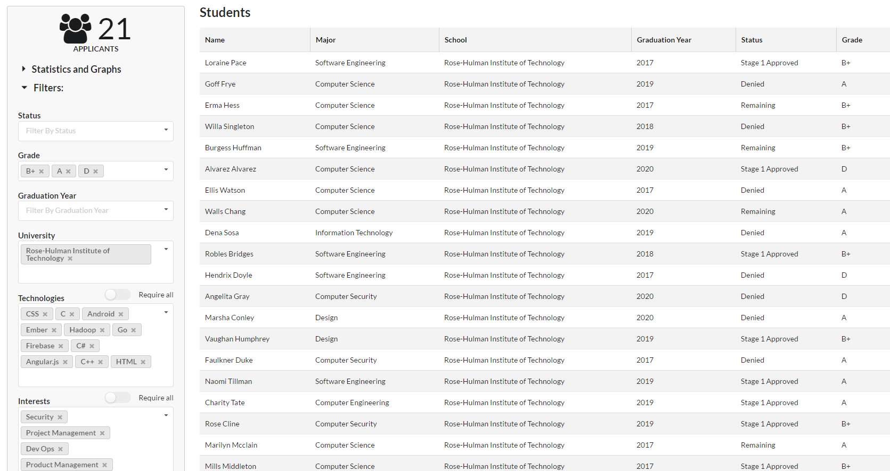
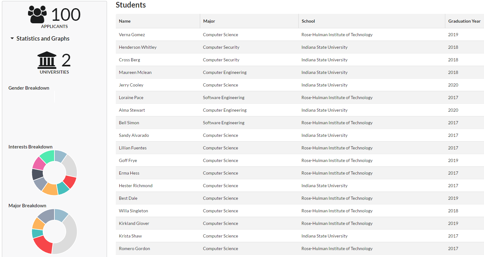
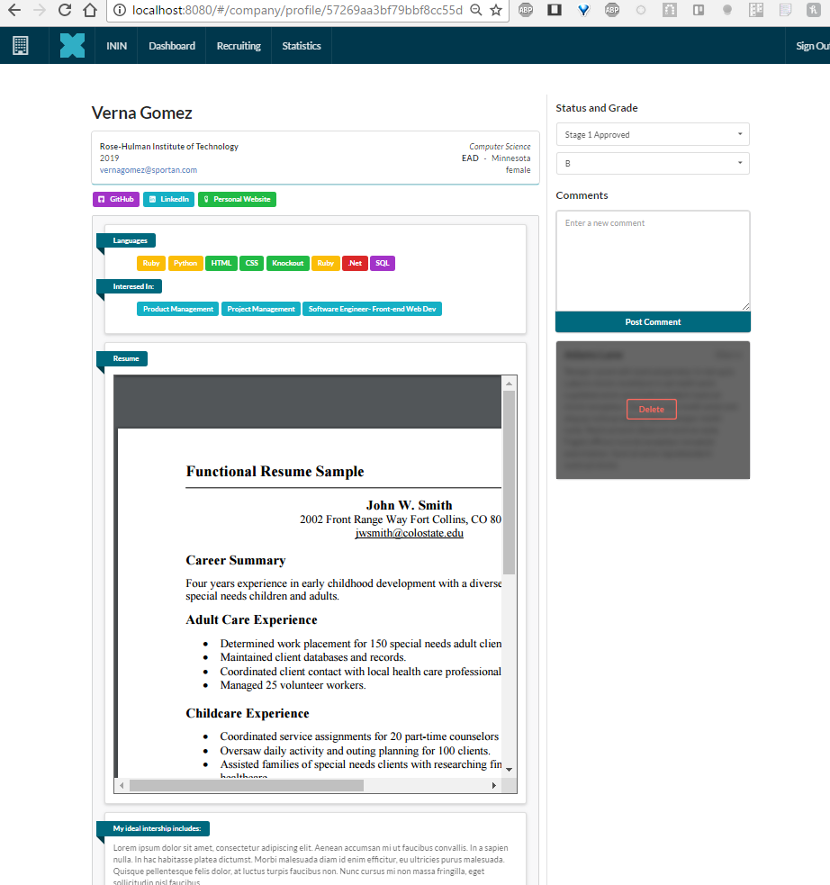

#Xtern Matching
#### _Senior Project - Crowley, Doolan, Niccum, Nygren_


>Xtern – the ultimate tech summer internship experience with Indianapolis technology companies. Powered by the technology non-profit internship experience – packages an experience around summer internship, TechPoint, Xtern provides free downtown housing, networking opportunities and an all-access pass to the arts, culture and social scene in Indianapolis. Programming has been deliberately designed with the intention of attracting top college talent to our growing tech community and creating a sense of place around Indianapolis with the goal of increasing retention rates upon graduation.

##The Project
The Xtern initiative is dependent on being able to recruit, vet, and place over a hundred summer interns every year from a plethora of universities around the nation. In the past, the vetting and placement portion of the process was done through Google forms and Google spreadsheets.
__Xtern Matching__ seeks to simplify this process by:
* Aggregating all of the responses from the forms in a central location
* Creating access levels for:
  * Techpoint Employees 
  * University Professors involved in the vetting process
  * Potential Host Companies

##The Process
Techpoint vets the Xtern applicants using a 3 stage process.

1. Techpoint goes through all of the applicants and rates them on a letter scale. As, B+s, and some Cs, advance.
 * Applicants who advanced are asked for more information and a coding sample

2. Professors from Indiana based Universities evaluate the applicants and highlight acceptable candidates
 1. All candidates highlighted are then approved/rejected by a second professor
 2. Candidates agreed upon are invited to Finalist Day in Indy and scheduled to interview with companies.

3. Finalist Day - Students interview with 3 different companies
 * Students and Companies fill out preference surveys and students are placed

##The Current Application 
###Logins and Separation of Permissions
The Current Application allows you to login in as a Company or as a Techpoint Employee through two different log in screens. All screens accessed after these portals are customized for the permission level.

 

 

###The Dashboard 
Most of the logic for the application is contained in the dashboard. The currently allows the user to view all of the available students in the system and filter them by a series of fields. The dashboard also displays at a glance statistics and charts based on the current filtering. 

 

 

 

####Future
 In the future, the dashboard will link to other pages like the student profile view

####Notes and Design
 The different components in the dashboard (ie: filters, graphs, table, ect.) are all reusable and fully customizable based off of JSON strings. They are set up to be reused in different modules of the application.
 In addition, the dashboard page itself takes a config variable and the company view dashboard has different filters, graphs, and column headers.  

###The Student Profile
The Student Profile Page allows the user to learn more information about the student and to view their resume. Skill and technologies are color-coded and comments on the page are restricted by permission level.



##Set Up
###Set Up
```bash
# Obtain Project
git clone https://github.com/Xtern-Matching/Combined.git
cd Combined

# Install Frond-End components
npm install #installs all of the packages

# Install Backend Components
goapp get

#Launch Site
npm start #launches the site on http://localhost:8080/

#Deploy Site
goapp deploy
```
###_Required Tools_
_Install these first_

1. [Node.js](https://nodejs.org/en/)
2. [Git](https://desktop.github.com/)
3. nodemon
```bash
npm install -g nodemon
```
4. [Google App Engine GO SDK](https://cloud.google.com/appengine/downloads#Google_App_Engine_SDK_for_Go)
    1. Download Go version of SDK
    2. Place SDK folder in place of choosing
    3. Set Add folder to one's PATH
    4. Set environment GOPATH to folder called gopath inside sdk
    5. Set environment GOROOT to folder called goroot inside sdk
    6. Navigate into the gopath folder, and create 3 folders: bin, pkg, and src
    7. Navigate into src folder and clone project

###npm install errors
In the unlikely case Semantic UI has installation errors:
```bash
npm install -g gulp
npm install semantic-u --save 
#Or

npm install
#Then
cd semantic-ui/
gulp build
```


